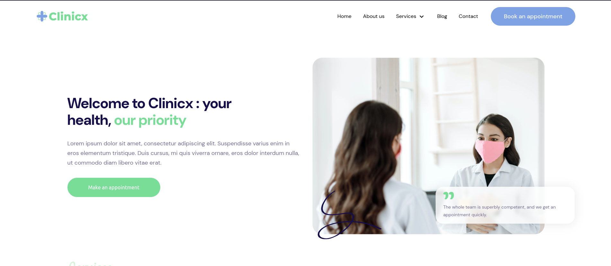

<h1>Clinicx</h1>

<br >

<hr >

<h4>Description</h4>
Clinicx is a comprehensive healthcare companion, designed to streamline your medical journey. <br >
Easily schedule appointments, access your medical records, receive reminders, and <br >
communicate with your healthcare team in one secure and user-friendly platform. <br >
Take control of your health and wellness with the Clinicx App <br >
<br >

<h4>Installation Guide</h4>
I'll assume you already have <strong>Node</strong> installed.

Start by cloning the repo:

```
https://github.com/bismarkboateng/Clinicx.git
cd Clinicx/
yarn
yarn dev
```

select the link running on your development server to preview<br>
the application